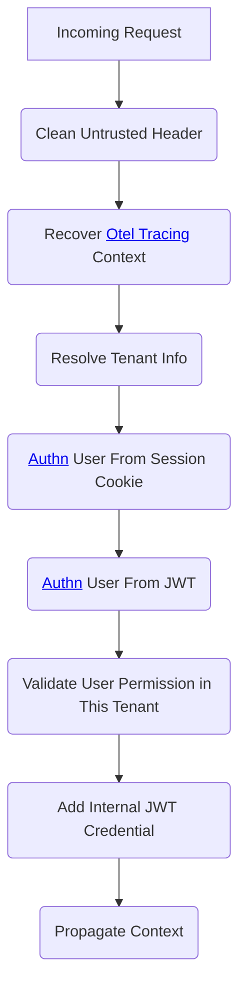

An API Gateway is a server or service that acts as an entry point to manage, control, and secure access to a collection of microservices or backend services in a distributed application or system.
Its primary purpose is to simplify and streamline the communication between clients (such as mobile apps or web applications) and multiple microservices by providing a unified and consistent interface.

## [APISIX](https://apisix.apache.org/)

>Apache APISIX provides rich traffic management features like Load Balancing, Dynamic Upstream, Canary Release, Circuit Breaking, Authentication, Observability, etc.

Thanks to [go-plugin-runner](https://apisix.apache.org/docs/go-plugin-runner/getting-started/) , we've been able to consolidate many common functions in the gateway and integrate other third-party systems more effectively with our authentication system.

### [kit_authn](https://github.com/go-saas/kit/blob/main/gateway/apisix/cmd/go-runner/plugins/kit_authn.go)

 

### [kit_authz](https://github.com/go-saas/kit/blob/main/gateway/apisix/cmd/go-runner/plugins/kit_authz.go)

See [authorization](./authorization)

### Initialize and migrate gateway

#### Migration

You can config routes and upsteams in the configuration of [sys module](../../modules/sys)

#### Sync services with registry

see [registry](./registry#Gateway%20Integration)