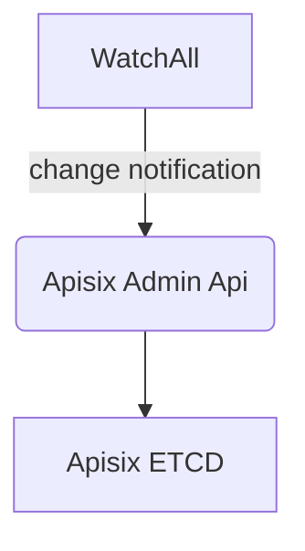

Registry and Service Discovery are two essential components in the context of distributed systems and microservices architecture. They play crucial roles in enabling dynamic and efficient communication between services within a distributed environment. 

**Registry**
A registry is a centralized or distributed database that stores information about available services within a network or system. 


**Service Discovery**
Service Discovery is the process by which a client or service component dynamically finds and communicates with other services within a distributed system. It involves querying a service registry or a similar mechanism to obtain information about the location and availability of required services.


The `Discovery` interface extend [`kratos.Discovery`](https://go-kratos.dev/en/docs/component/registry) with `WatchAll` for [gateway integration](#Gateway%20Integration)
```go
// Discovery is service discovery.
type Discovery interface {
	registry.Discovery
	// WatchAll creates a watcher to all services
	WatchAll(ctx context.Context) (registry.Watcher, error)
}
```

## Provider

### Etcd

In your configuration

```yaml
services:
  registry:
    type: etcd
    endpoint: http://etcd:2379 # your etcd endpoint
```

:::tip
We recommend using etcd because APIsix and DTM are already using etcd. Using other service discovery solutions may increase operational complexity.
:::

## [Dtm](./distributed-transaction#DTM) Integration

see 
- https://github.com/dtm-labs/dtmdriver-kratos  
- https://github.com/dtm-labs/dtmdriver-clients

## [Gateway](./gateway) Integration



The flow is currently embedded into [sys module](../../modules/sys)