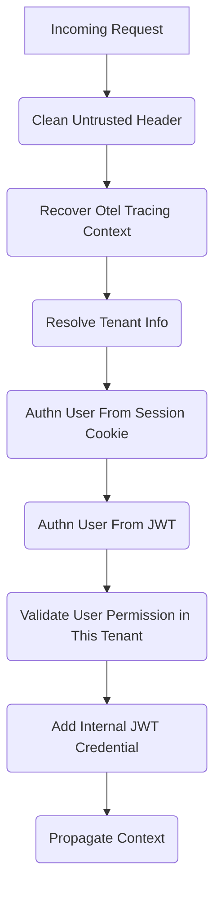

```mermaid
graph TD
    A[Incoming Request] -->B(Clean Untrusted Header)
    B --> C(Recover Otel Tracing Context)
    C --> D(Resolve Tenant Info)
    D --> E(Authn User From Session Cookie)
    E --> F(Authn User From JWT)
    F --> G(Validate User Permission in This Tenant)
    G --> H(Add Internal JWT Credential)
    H --> I(Propagate Context)
```